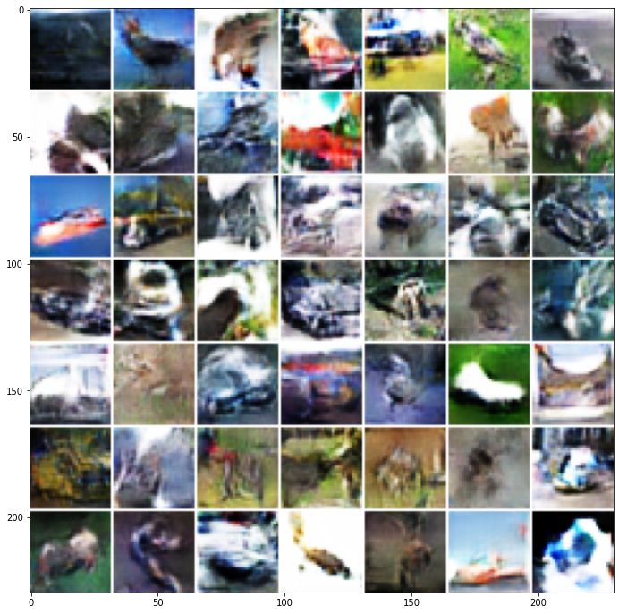
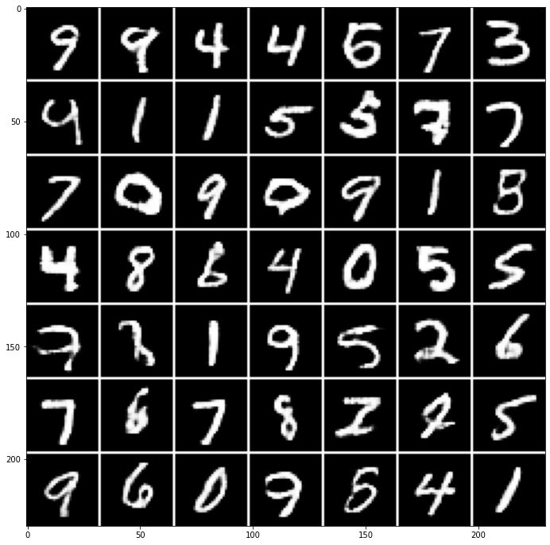
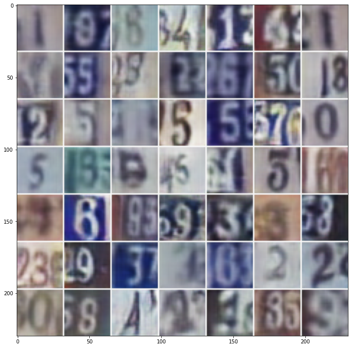

# generative-models
This repo contains implementations of different different generative models. This implementations are part of the "Learning Generative Models" course that I took on summer 2020 at OvGU Magdeburg. Besides my efforts to do these assignments the code is adapted from ideas of fellow students and our respected Tutor.  
Since the ipynb file become very very big witincluding the outputs, I have uploaded only the code. Part of generated images can be found below.
### 1. GAN 
This model trained for 25000 steps on cifar10 dataset. 

### 2. Wasserstein GAN
This model trained for 10000 steps on mnist dataset

  and 25000 steps on street view house number (SVNH) dataset

